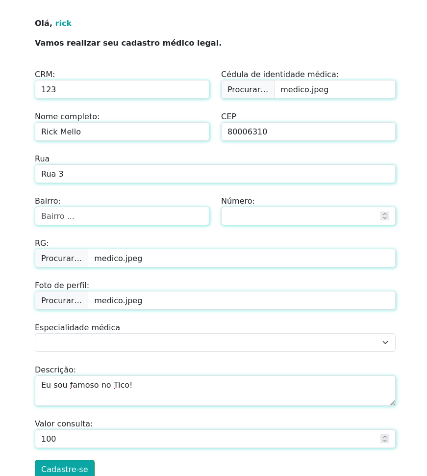

#  Criando super USER

Ele vai ser importante para podermos administrar e criar algumas funcionalidades, por exemplo, a especialidade do médico.

Para isso, antes de subir a aplicação, no terminal:
~~~
python manage.py createsuperuser
~~~

Após preencher, suba aplicação:

~~~
python manage.py runserver
~~~

Acesse: 

[http://127.0.0.1:8000/admin/] (http://127.0.0.1:8000/admin/)

# As páginas do Projeto

## Logar cliente 
[http://127.0.0.1:8000/usuarios/login/](http://127.0.0.1:8000/usuarios/login/)

## Cadastro Médico 

[http://127.0.0.1:8000/medico/cadastro_medico/](http://127.0.0.1:8000/medico/cadastro_medico/)

