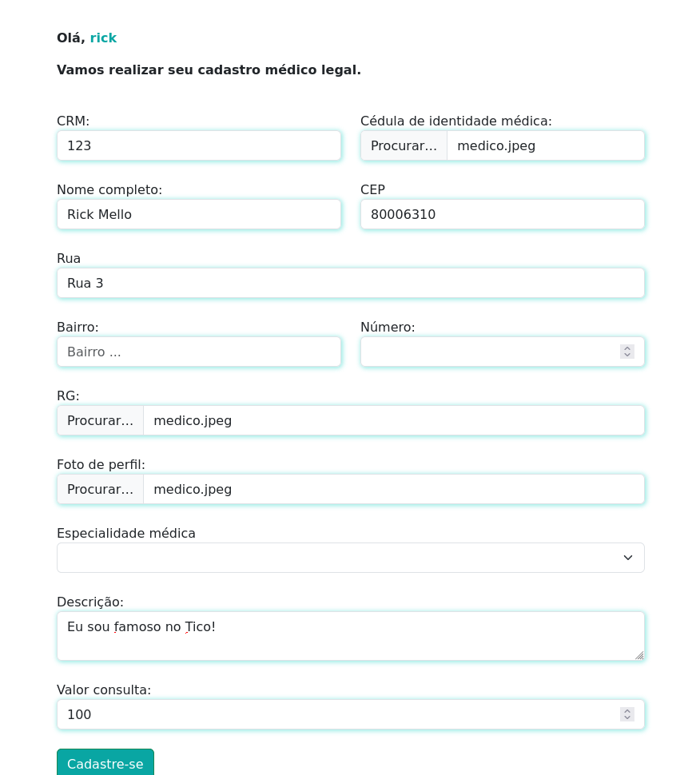

# As páginas do Projeto

## Logar cliente 
[http://127.0.0.1:8000/usuarios/login/](http://127.0.0.1:8000/usuarios/login/)

## Cadastro Médico 

[http://127.0.0.1:8000/medico/cadastro_medico/](http://127.0.0.1:8000/medico/cadastro_medico/)

## ADM 
